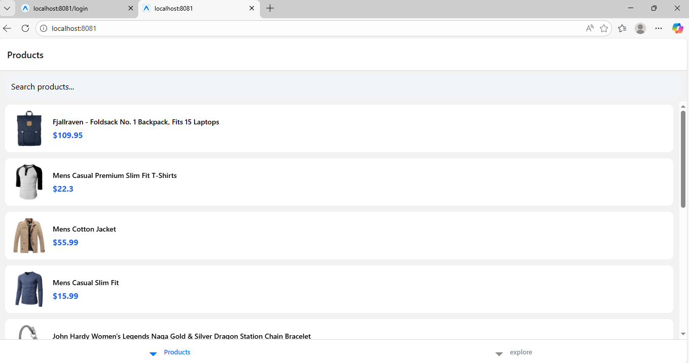

# Product App – React Native

## 📱 Project Overview
A React Native product application built using Expo Router and Context API.  
The app fetches and displays products, allows searching, and navigates to detailed product views.

---

## 🚀 Features
- Product listing with API integration
- Search functionality
- Product detail screen
- Context API for global state
- Expo Router based navigation
- Reusable components
- Clean and responsive UI

---

## 🖼 Screenshots

### Login Screen

### Product Lists

### Product Details

### Search Feature

---

## 🎥 Description
Product App (React Native)
This is a React Native product listing application built using Expo Router and Context API. The app displays products in a clean and responsive UI with search functionality, product detail navigation, and state management using contexts. It includes API integration for fetching products, reusable UI components, and smooth navigation between screens. The project demonstrates best practices for structuring a React Native app, handling global state, and building scalable mobile applications.

---

## 🛠 Tech Stack
- React Native
- Expo
- Expo Router
- Context API
- JavaScript / TypeScript

npm install
npx expo start
